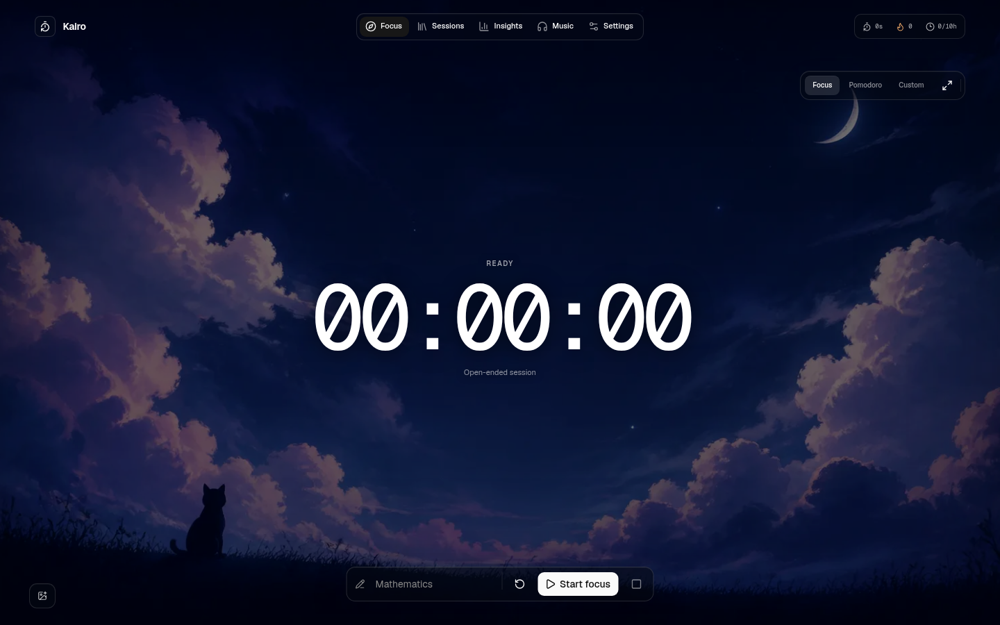

# Kairo

Kairo is a calm, local-first focus timer and study tracker. It combines open-ended focus sessions, customizable Pomodoro cycles, study history, lightweight insights, and a distraction-free YouTube music shelf in one desktop-sized interface.



## Highlights

- Open-ended, custom-duration, and configurable Pomodoro timers
- Short and long breaks, round controls, and optional automatic phase starts
- Refresh-safe timers that restore running or paused state accurately
- Daily goals, lifetime totals, streaks, session history, weekly rhythm, and activity heatmap
- Multiple YouTube playlists with reorderable track queues and continuous playback
- Persistent music while navigating between sections
- Fullscreen focus mode and completion sound
- Custom wallpapers stored locally in IndexedDB
- Portable JSON backup and restore
- No account, analytics service, database, or cloud sync

## Local-first by design

Kairo stores sessions, playlists, timer state, and preferences in browser storage. Uploaded wallpapers use IndexedDB. Nothing is sent to a Kairo server, because there is no Kairo server.

This makes the current web app private and simple, but browser data can be removed by clearing site storage. Use **Settings → Export backup** if you want a portable copy.

## Getting started

Requirements:

- Node.js 20 or newer
- npm 10 or newer

```bash
git clone https://github.com/Rudra78996/kairo.git
cd kairo
npm install
npm run dev
```

Open [http://localhost:3000](http://localhost:3000).

No environment variables are required.

## Commands

```bash
npm run dev      # Start the development server
npm run lint     # Run ESLint
npm run build    # Create a production build
npm run start    # Run the production server
```

## Tech stack

- Next.js 15 and React 19
- TypeScript
- Tailwind CSS 4
- shadcn/ui with Base UI primitives
- Recharts
- Lucide icons
- Browser `localStorage` and IndexedDB

## YouTube playback

Kairo embeds YouTube videos and playlists using YouTube's privacy-enhanced domain. Playback availability is still controlled by YouTube and the video owner; private, removed, region-restricted, age-restricted, or embedding-disabled videos may not play.

## Contributing

Issues and focused pull requests are welcome. Please run `npm run lint` and `npm run build` before opening a pull request.

## License

Kairo is released under the [MIT License](LICENSE).

The default Kairo night wallpaper was generated specifically for this project. It is distributed with the project under the same MIT License.
